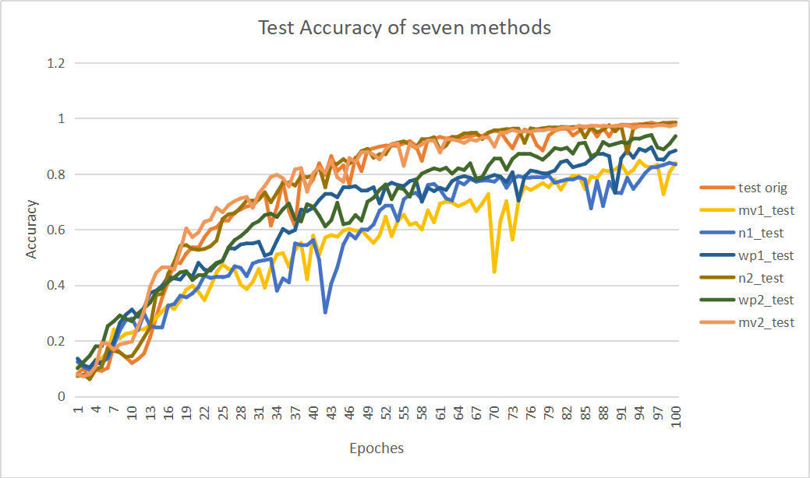

I rewrote the code today and wrote the following code:

​		mean_value_version1.py

​		mean_value_version2.py

​		weight_p_version1.py

​		weight_p_version2.py

​		nonlinear_version1.py

​		nonlinear_version2.py

version1 and version2 use two different methods to add new vectors.

Experiments were conducted on two official examples of pytorch_geometric, where
one example showed a significant overfitting (train=0.9, test=0.5), so the
results on the example were not collated. The accuracy of the seven methods is
compared on another example, as shown below.

See the code <https://github.com/Andrew-Pei/work_report/tree/master/different_topk>.
