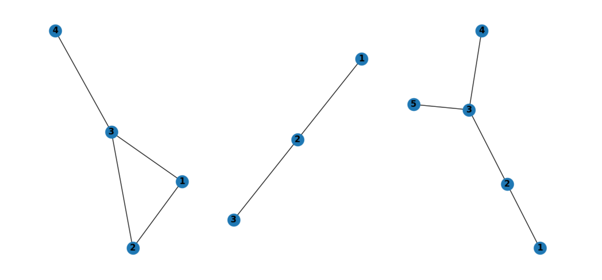

图1的分数为：2,4,3,1

图2的分数为：1,1.5,2

图3的分数为：1,2,3,6,1

\>\>\> num_nodes

tensor([4, 3, 5])

\>\>\> batch_size

3

\>\>\> max_num_nodes

5

\>\>\> cum_num_nodes

tensor([0, 4, 7])

每张图第一个点的索引

\>\>\> index

tensor([ 0, 1, 2, 3, 5, 6, 7, 10, 11, 12, 13, 14])

0123（4）

567（89）

10 11 12 13 14

\>\>\> dense_x

tensor([[ 2, 4, 3, 1, -2],

[ 1, 1, 2, -2, -2],

[ 1, 2, 3, 6, 1]])

dense_x穿插假的点，其值为-2

\>\>\> perm

tensor([[1, 2, 0, 3, 4],

[2, 0, 1, 3, 4],

[3, 2, 1, 0, 4]])

排序（从大到小）后的图内索引

\>\>\> perm

tensor([[ 1, 2, 0, 3, 4],

[ 6, 4, 5, 7, 8],

[10, 9, 8, 7, 11]])

再变成global索引

再拉成一列

\>\>\> k

tensor([2, 2, 3])

k是一次pool后的num_nodes

\>\>\> mask

[tensor([0, 1]), tensor([5, 6]), tensor([10, 11, 12])]

Mask是根据k计算得出的留下的节点的perm索引
