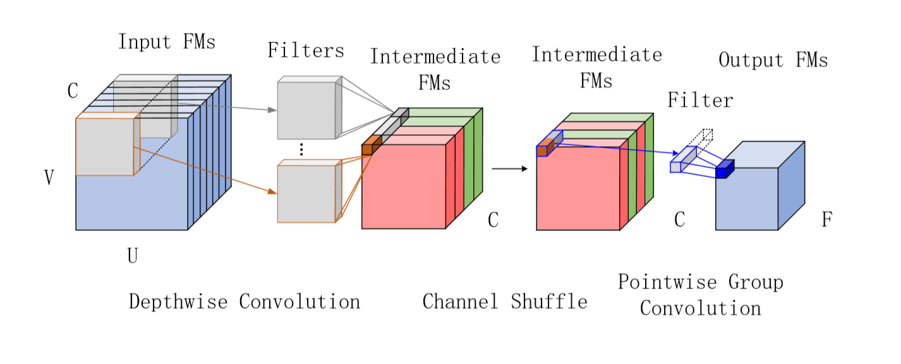

Weekly work report
==================

1.  At the beginning of this week, I used visio to draw a schematic diagram of
    the DW+PGC network. The results are as follows:

1.  After discussion, I added the dimension of p to the code in six ways and got
    the accuracy results of different methods.

2.  At the weekend, in order to visually show the nodes that were lost during
    the topk pooling process, I learned about the TensorFlow framework (because
    I used the mxnet and pytorch frameworks before) and the tensorboard tool to
    visualize it, but it failed. Because the visualize function in tensorboard
    is too singular.Although it failed, I learned the TensorFlow framework and
    some basic operations of tensorboard.

3.  After discussion, I decided to set the method of improving the threshold to:
    find the ratio of the adjacent two items in the sorted score vector, and cut
    off at the maximum ratio.

Future plan:
------------

1.  Implement the threshold code.

2.  Increase the p dimension: Analyze the previous results.

3.  Visualization: Try other visualization tools:
    [GUESS](http://graphexploration.cond.org/),
    [Graphviz](http://www.graphviz.org/),
    [Cytoscape](http://www.cytoscape.org/),
    [Prefuse](http://prefuse.org/),
    [NodeXL](http://nodexl.codeplex.com/).

	If this doesn't work, write my own code.

4.  Implement the same improvements on sag_pool and compare the results.
