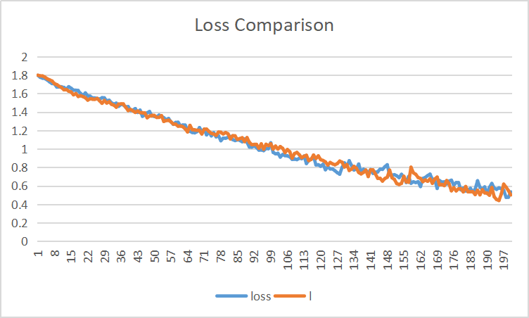

Weekly Work Report
==================

1.  At the beginning of the week, I thought about how to join the threshold mechanism. I don't think it's possible to filter a node with a fixed threshold as discussed earlier. Therefore, I first sort all the node scores, then calculate the score ratio of the nodes with the scores adjacent to each other, and filter at the point where the score ratio is the largest.

2.  Then, I wrote the topk_threshold code(see the different topk folder) and conduct several experiments. The result indicates that there is little difference between the threshold version and non-threshold version. The Loss figure is shown below:

I think I should design more experiment to find out the truth.

3.  Then I wrote the visualization code(see the different topk folder) using NetworkX, a Python package for the creation, manipulation, and study of the structure, dynamics, and functions of complex networks. But I have not debug it.

4.  I have tried several methods to avoid the overfitting of a official test example. But I failed. The best test accuracy is about 55% while the train accuracy is up to 99%. Both the dropout method and regularization method do not work and the test accuracy shows that the test dataset maybe too small. I have no idea about how to deal with it. Therefore I decided to wrote my test examples rather than using the official test examples.

Future plan:
------------

1.  Threshold: write more test examples and design more experiments to find out the truth.

2.  Visualization: debug it and analyze the results.

3.  Increase P dimension: analyze the results.

4.  Transfer to SAG_Pool and do comparison.
